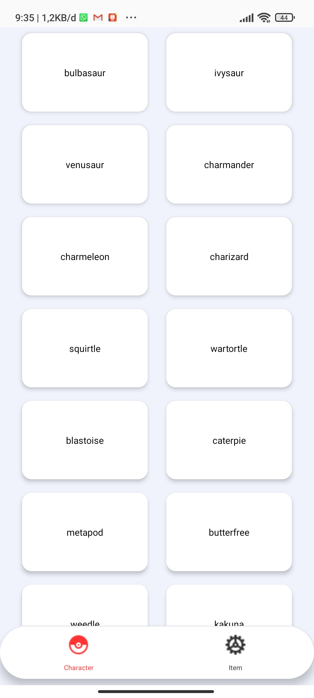
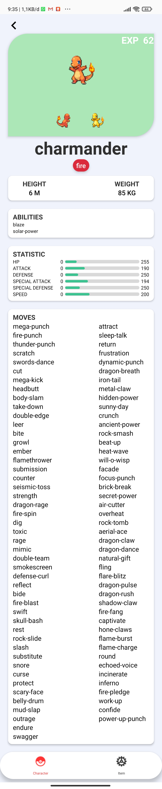
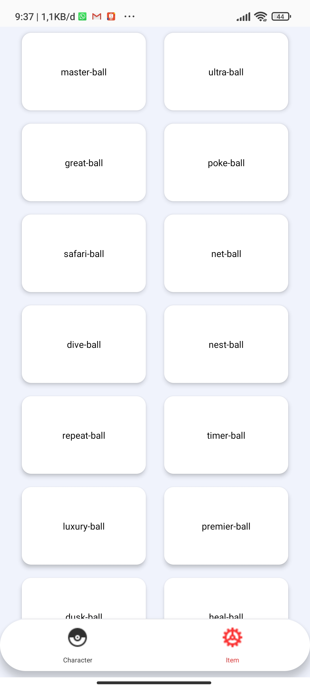
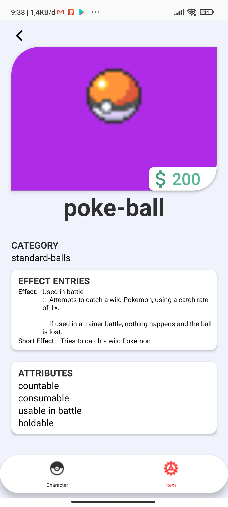

# PokemonApp
React Native application with Pokemon API.

## Before Run
execute this command : 
1. yarn install for installing dependecies
2. npx react-native link for linking modules

## ScreenShoot of the app
List Characters of Pokemon

List Character detail 

List Items for Pokemon

List Item detail
